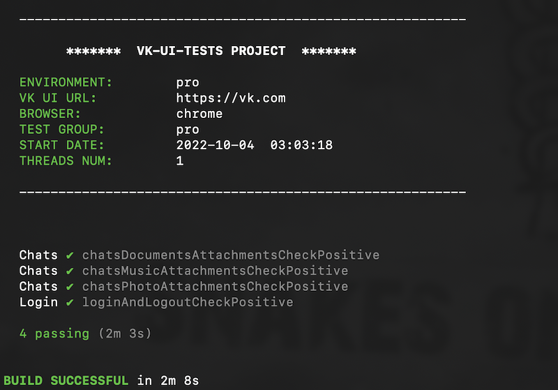

## VK UI Tests project
This project contains several UI tests for [vk.com](https://vk.com) web service.

### Stack
* Java 16 
* Gradle
* TestNG
* Selenium / Selenide framework. More information [Selenide Documentation](https://selenide.gitbooks.io/user-guide/content/)
* Adarshr test-logger plugin.
* Gradle test-retry plugin.



### Common information 
##### VK UI Tests prerequisites:
To start you must create "sre.secrets.properties" file or rename "template.vk.secrets.properties" template file 
in root dir of "vk-ui-tests" project. Set your credentials in "login" and "password" fields.

```sh
# --------------------------
# [ VK SECRETS ] credentials:
# Set your credentials(login and password).

userLogin: 79996798838
userPassword: YourSecretPswd

# --------------------------
```

### Configuration

##### System variables 
| Variable | Default | Definition |
| -------- | ------- | ---------- |
| -Denv | PRO | VK instance for testing. Fill required settings. Run test with **-Denv**=pro or **-Denv**=stage |
| -Dthreads | 1 | Amount of parallel threads |
| -Dbrowser | CHROME | Available: 'chrome', 'firefox', 'ie'. |
| -Dchromeoptions.args |  | Use '--headless, --disable-gpu, --no-sandbox' params for headless tests running. |

Variables can be set in 'VM options'  (IDEA / menu Run / Edit Configuration / Gradle)

### Running from Terminal
Base running(all tests) with headless mode, for example:
```sh
$ ./gradlew test -Denv=pro -Dthreads=2 -Dbrowser=chrome -Dchromeoptions.args='--headless, --disable-gpu, --no-sandbox'
```
Running with filter by test with headless mode, for example:
```sh
$ ./gradlew test -Denv=pro -Dthreads=2 -Dbrowser=chrome -Dchromeoptions.args='--headless, --disable-gpu, --no-sandbox' --tests '*chatsMusicAttachmentsCheckPositive*'
```

### Reporting
* View Allure report from local run: start task "allureServe {}" in build.gradle file. After this Allure Page will be opened automatically.
If you want you can use terminal command:
```sh
$ ./gradlew allureServe
```
* More information [Allure Documentation](https://docs.qameta.io/allure-report).
* Allure Framework repository [Allure GitHub](https://github.com/allure-framework).
